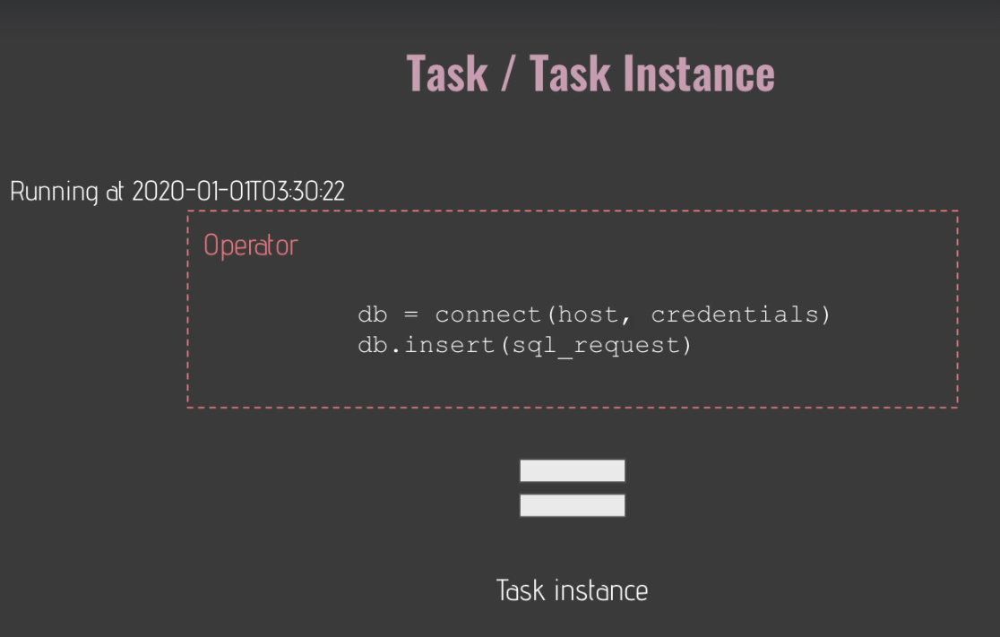
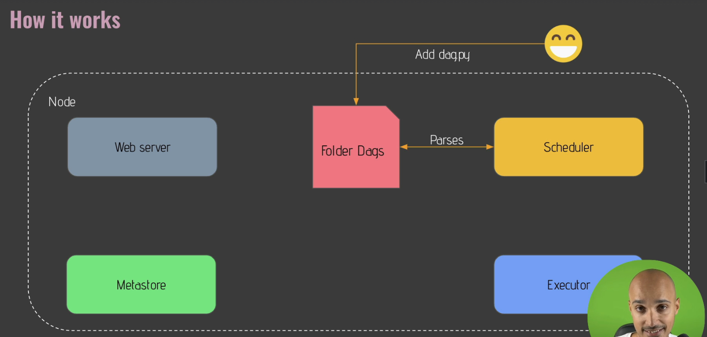

# airflow
https://pplearn.udemy.com/course/the-complete-hands-on-course-to-master-apache-airflow/learn/lecture/32787474#overview

<br><br><br>

# 
```bash
# crontab
# https://crontab.guru/#30_2_*_*_*
30      2       *              *               *
mins    hrs     day(month)    month     day(week)

at 2:30 every day

```

# Get started with airflow
## 1. What is airflow?
an open source platform to programmatically author, schedule and monitor workflows

<br><br><br>

## 2. Core components
1. Web server
2. Scheduler
3. Metastore
4. Trigger
5. Executor
6. Queue
7. Worker
- 


## 3. Core concepts

1. DAG (Directed Acyclic Graph)
    - 


2. Operator
    - Action Opeartor
    - Transfer Operators
    - Sensor Operators
    - 
    


3. Task/ Task Instance
    - 

4. Workflow
    - 

<br><br><br>

## 4. Airflow is not
Airflow is not a `data streaming` solution neither a `data processing` framework

<br><br><br>

## 5. Single node architectures


<br><br><br>

## 6. Multi Nodes architecture (Celery)


## 7. Execution flow

1. create a new dag.py and put into folder of `dags`
    - 

2. every 5 minute detect new dag/ 30s after modification
    - 

3. Scheduler runs dag and create DagRun Object with state `running`
    - 

4. schedules taskinstance object state `null` and scheduled
    - 
5. sends taskintance to the Executor, taskinstance `queued`
    - 
6. Executor create sub process to run the task
    - 
7. taskinstance in `running` state
    - 
8. and taskinstance is in success or failed
    - 

<br><br><br>

## 8. installing apache airflow
- (startup airflow)[https://airflow.apache.org/docs/apache-airflow/2.5.1/docker-compose.yaml]
```bash
$ docker-compose up -d

$ docker-compose ps

```
- 


<br><br><br>

## 9. docker compose


<br><br><br><br><br><br>

# 2. The important views of Airflow UI

1. Grid view
    - 


2. Graph view
    - 
    
3. Landing time
    - 
    

4. Gantt View
    - paralize

5. Code view
    - 
    


<br><br><br><br><br><br>

# 3. Coding your first data pipeline with airflow

1. the project
    - 
    
    
    

<br><br><br>

## 3.1 what is DAG
    - Directed Acyclic Graph
    - 

## 3.2 DAG skeleton
1. ID
2. define start_date
3. schedule_interval
4. catchup=False, tasks between last and now
```python
import datetime import datetime

from airflow import DAG


with DAG('user_processing', start_date=datetime(2022,1 ,1), 
         schedule_interval='@daily', catchup=False) as dag:
    None
```

<br><br><br>

## 3.2 what is operator
1. An Operator
    - Defines `ONE TASK` in your data pipeline
    - DONT and DO
        - 
    - 3 types of operator
        - Action Operators: `Execute` and action
        - Transfer operators: `Transfer`` data
        - Sensors: `Wait`` for a condition to be met

<br><br><br>

## 3.3 The provider
- [check all provider](https://registry.astronomer.io/)
- 


<br><br><br>

## 3.3 Create a table

```python
from datetime import datetime


from airflow import DAG
from airflow.providers.postgres.operators.postgres import PostgresOperator

with DAG('user_processing', start_date=datetime(2022,1 ,1), 
         schedule_interval='@daily', catchup=False) as dag:
    
    create_table = PostgresOperator(
        task_id='create_table',
        postgres_conn_id='postgres',
        sql='''
            CREATE TABLE IF NOT EXISTS users(
                firstname TEXT NOT NULL,
                lastname TEXT NOT NULL,
                country TEXT NOT NULL,
                username TEXT NOT NULL,
                password TEXT NOT NULL,
                email TEXT NOT NULL
            );
        '''
    )
```

<br><br><br>

## 3.4 create connection
- create connection on airflow `Admin -> Connections`
- 


<br><br><br>

## 3.5 secret weapon
```bash

$ docker-compose ps
# into the airflow scheduler
$ docker exec -it airflow-airflow-scheduler-1 bash
# INSIDE container
>> airflow -h
>> airflow tasks test user_processing create_table 2022-01-01
```
- 


```bash
# list all connection
>> airflow connections -l
>> airflow connections list
```

<br><br><br>

## 3.6 what is sensor?

1. poke_interval

2. timeout

<br><br><br>

## 3.7 is_api_available
```python
is_api_available = HttpSensor(
    task_id='is_api_available',
    http_conn_id='user_api',
    endpoint='api/'
)
```

<br><br><br>

## 3.8 extract_user
```python
# Due to coporation SSL issue
# 1. create task_id
# 2. use http connection
# 3. endpoint as api
# 4. method as GET
# 5. get response and trasformed as json
# 6. display result
extract_user = SimpleHttpOperator(
    task_id='extract_user',
    http_conn_id='user_api',
    endpoint='api/',
    method='GET',
    response_filter=lambda response: json.loads(response.text),
    log_response=True
)
```

<br><br><br>

## 3.9 process_user
1. no dependency
    - 

```python

# setup dependency
extract_user >> process_user
```
- 


## 3.10 what is hook
postgresHook behind postgresOperator
- 

```python

# COPY the users from FILE into TABLE users in postgres
def _store_uesr():
    hook = PostgresHook(postgres_conn_id='postgres')
    hook.copy_expert(
        sql="COPY users FROM stdin WITH DELIMITER as ','",
        filename='/tmp/processed_user.csv'
    )
  
store_user = PythonOperator(
    task_id='store_user',
    python_callable=_store_uesr
)

extract_user >> process_user >> store_user

```

## 3.11 orders
```python
create_table >> is_api_available >> extract_user >> process_user >> store_user
```
- 

<br><br><br>

## 3.12 DAG in action
```bash
$ docker-compose ps

# check whether csv file created
$ docker exec -it airflow-airflow-worker-1 bash

$ ls /tmp/

# check whether db saved the files
$ docker exec -it airflow-postgres-1 bash
$ psql -Uairflow
>>SELECT * FROM users;

```

<br><br><br>

## 3.13 DAG scheduling 
1. start_date: The timestamp from which the scheduler will attempt to backfill
2. schedule_interval: how often a DAG runs
3. end_date: the timestamp from which a DAG ends
```python
with DAG('user_processing',
         start_date=datetime(2022, 1, 1),
         schedule_interval='30 2 * * *',
         catchup=False) as dag:
```
- <br>

A DAG is trigged After  the start_date/last_run + the schedule_interval<br>
Assuming a start date at 10:00AM and a scheduler interval every 10mins<br>
- 


<br><br><br>

## 3.14 Backfilling

```python
with DAG('user_processing',
         start_date=datetime(2022, 1, 1),
         schedule_interval='30 2 * * *',
         catchup=True) as dag:
```
- 